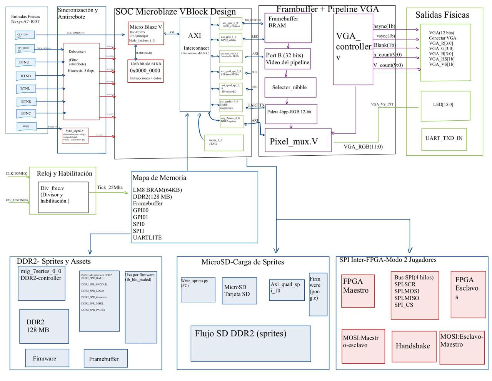

# Pong Multijugador — Sistema Embebido en Nexys A7-100T

Sistema embebido sobre FPGA que implementa el juego Pong e integra MicroBlaze V
(RISC-V), firmware bare-metal en C, salida VGA 640×480 @ 60 Hz, framebuffer en BRAM,
memoria DDR2 para sprites y assets, microSD como fuente externa de imágenes y
comunicación SPI entre dos placas para el modo multijugador.

**Curso:** EL3313 Taller de Diseño Digital, I Semestre 2026  
**Placa:** Digilent Nexys A7-100T (`xc7a100tcsg324-1`)  
**Herramientas:** Vivado 2024.1 / Vitis 2024.1

---

## Tabla de contenidos

1. [Descripción del proyecto](#1-descripción-del-proyecto)
2. [Hardware y herramientas requeridas](#2-hardware-y-herramientas-requeridas)
3. [Arquitectura del sistema](#3-arquitectura-del-sistema)
4. [Estructura del repositorio](#4-estructura-del-repositorio)
5. [Archivos clave](#5-archivos-clave)
6. [Inicio rápido](#6-inicio-rápido)
7. [Flujo de compilación — Hardware (Vivado)](#7-flujo-de-compilación--hardware-vivado)
8. [Flujo de compilación — Firmware (Vitis)](#8-flujo-de-compilación--firmware-vitis)
9. [Programación de la FPGA por JTAG](#9-programación-de-la-fpga-por-jtag)
10. [Preparación de la microSD](#10-preparación-de-la-microsd)
11. [Cómo jugar](#11-cómo-jugar)
12. [Modo 2 jugadores — conexión entre FPGAs](#12-modo-2-jugadores--conexión-entre-fpgas)
13. [Mapeo de pines y periféricos](#13-mapeo-de-pines-y-periféricos)
14. [Resultados de síntesis](#14-resultados-de-síntesis)
15. [Cumplimiento de requerimientos del proyecto](#15-cumplimiento-de-requerimientos-del-proyecto)
16. [Estado funcional del proyecto](#16-estado-funcional-del-proyecto)
17. [Notas técnicas importantes](#17-notas-técnicas-importantes)
18. [Errores comunes y soluciones](#18-errores-comunes-y-soluciones)
19. [Buenas prácticas aplicadas](#19-buenas-prácticas-aplicadas)
20. [Repositorio público](#20-repositorio-público)
21. [Nota de uso de Inteligencia Artificial](#21-nota-de-uso-de-inteligencia-artificial)
22. [Autores](#22-autores)

---

## 1. Descripción del proyecto

El sistema implementa el juego Pong clásico con las siguientes características:

- **Modo 1 jugador**: el jugador controla la paleta derecha con `BTNU`/`BTND`; la IA
  controla la paleta izquierda con velocidad variable y reacción con retraso aleatorio.
- **Modo 2 jugadores**: cada FPGA renderiza un campo de 640×480 del tablero virtual de
  1280×480. El Maestro (`SW[0]=0`) controla la física y envía estado completo (posición
  de pelota, paletas, marcador y estado de juego) vía SPI al Esclavo (`SW[0]=1`), que
  responde con la posición de su paleta local.
- **Video**: salida VGA 640×480 @ 60 Hz, 16 colores con paleta de índice de 4 bits
  codificada en hardware.
- **Sprites**: el firmware pre-carga sprites sólidos por defecto en DDR2 al arrancar
  (`ddr2_sprite_defaults`). Si la microSD inicializa correctamente, los sprites BMP
  preparados con `write_sprites.py` se cargan sobre esos valores.
- **Puntuación**: el primero en alcanzar 10 puntos gana. El marcador se muestra en
  pantalla y en los LEDs de la placa.

El selector de modo es `SW[0]` (pin J15): en `0` el firmware actúa como Maestro o en
modo 1P; en `1` actúa como Esclavo en una partida 2P.

---

## 2. Hardware y herramientas requeridas

### Hardware

| Elemento | Descripción |
| --- | --- |
| Placa FPGA | Digilent Nexys A7-100T (`xc7a100tcsg324-1`) |
| Monitor | VGA, 640×480 @ 60 Hz o superior |
| Cable USB | Programación JTAG y consola UART (mismo cable micro-USB) |
| microSD | Requerida para validar carga de sprites externos; opcional para el modo básico con sprites por defecto |
| Segunda Nexys A7-100T | Requerida para el modo 2P; opcional para modo 1P |
| Cables hembra-hembra | 5 cables para conectar los PMOD JA en modo 2P |

### Software

| Herramienta | Versión | Uso |
| --- | --- | --- |
| Xilinx Vivado | 2024.1 | Síntesis, implementación y generación de bitstream |
| Xilinx Vitis / XSCT | 2024.1 | Compilación del firmware C y generación de BSP |
| XSDB | incluido en Vivado/Vitis | Programación JTAG y carga del ELF |
| Python 3.8+ con Pillow | cualquiera | Conversión de sprites BMP a 4bpp y escritura en microSD |
| Terminal serie | minicom, PuTTY o similar | Diagnóstico UART a 115 200 baud |

Instalar Pillow si no está disponible:

```bash
pip install Pillow
```

Rutas esperadas por defecto en los scripts de automatización:

```text
Vivado : /tools/Xilinx/Vivado/2024.1/settings64.sh
Vitis  : /tools/Xilinx2/Vitis/2024.1/settings64.sh
```

> `build_all.sh` detecta Vivado en PATH, en la variable `VIVADO_ROOT` o en rutas fijas
> comunes, por lo que no es necesario ajustar la ruta manualmente en la mayoría de los casos.

---

## 3. Arquitectura del sistema

### Diagrama de bloques



### Visión general

```text
microSD (SPI1) MicroBlaze V (rv32i)
                  LMB BRAM 64 KB (código + datos)
                        |
          +-------------+------------------+------------------+
          |             |                  |                  |
         AXI           AXI               AXI               AXI
          |             |                  |                  |
    BRAM framebuffer  DDR2 128 MB       GPIO0             SPI0
    Port A (escrit.)  (sprites/assets)  (botones/SW/vsync) (inter-FPGA 2P)
          |
    Port B (lect.)
          |
    Controlador VGA al monitor
    640x480 @ 60 Hz
```

### Procesador

El núcleo de procesamiento es un **MicroBlaze V** configurado como procesador RISC-V rv32i
dentro del Block Design de Vivado (`BD/microblaze_v.bd`). Ejecuta firmware bare-metal en C
(`src/sw/pong.c`) cargado desde el host por JTAG. No utiliza sistema operativo.

**Justificación**: MicroBlaze V es el procesador soft-core disponible en el ecosistema
Vivado/Vitis para Artix-7. Al ser rv32i, es compatible con la cadena de herramientas
RISC-V estándar y elimina la dependencia de toolchains propietarios. Su integración
nativa con AXI4 simplifica la conexión de periféricos (GPIO, SPI, UART, MIG DDR2)
sin necesidad de bridges adicionales.

### Justificación del firmware bare-metal

El proyecto utiliza firmware bare-metal en lugar de un sistema operativo por las
siguientes razones técnicas:

- **Menor sobrecarga**: sin capa de OS, el firmware accede directamente a los registros
  de los periféricos AXI mediante `XGpio`, `XSpi`, `Xil_Out32` e `Xil_In32` sin
  overhead de planificación ni gestión de procesos.
- **Control determinístico del ciclo principal**: el loop de juego sincroniza el
  renderizado con el vsync leyendo el bit 5 de GPIO0 directamente, garantizando una
  cadencia de frame predecible.
- **Acceso directo al framebuffer**: el firmware escribe píxeles a `FB_BASE`
  (`XPAR_AXI_BRAM_CTRL_0_BASEADDR`) mediante `Xil_Out32` sin intermediarios,
  maximizando la tasa de actualización de pantalla.
- **Suficiente para la aplicación**: un juego embebido con física simple, lectura de
  botones, renderizado VGA y SPI es inherentemente secuencial y no requiere los
  servicios de un RTOS.
- **Integración directa con drivers Xilinx**: `pong.c` usa la BSP `standalone`
  generada por Vitis, con `XGpio`, `XSpi` y `xil_printf` integrados directamente.

### Subsistema de video (framebuffer)

**Justificación del framebuffer en BRAM**: usar BRAM como framebuffer desacopla el
procesador (que escribe en cualquier orden y momento) del controlador VGA (que necesita
leer píxeles en orden estricto a 25 MHz). Esto permite al CPU actualizar regiones
arbitrarias de la pantalla sin impactar el timing VGA.

El framebuffer está almacenado en una BRAM True Dual Port instanciada en el Block Design:

| Parámetro | Valor |
| --- | --- |
| Resolución | 640 × 480 píxeles |
| Profundidad de color | 4 bits por píxel (índice de paleta) |
| Tamaño total | 38 400 palabras de 32 bits |
| Empaquetado | Big-endian: `word[31:28]` = píxel 0 … `word[3:0]` = píxel 7 |
| Puerto A | 32 bits, AXI — escritura por el firmware |
| Puerto B | 32 bits, nativo a 100 MHz — lectura por el controlador VGA |

Cálculo de dirección para un píxel en coordenadas `(x, y)`:

```text
pixel_idx = y * 640 + x
word_addr = pixel_idx >> 3
nibble    = pixel_idx[2:0]   (selecciona uno de los 8 nibbles en la palabra)
```

### Pipeline VGA

**Justificación**: el controlador VGA genera señales de sincronismo y coordenadas de
pixel a 25 MHz a partir del reloj de 100 MHz, usando un divisor parametrizable
(`div_frec`, `DIVISOR=4`) para evitar crear un dominio de reloj adicional y simplificar
el análisis de timing.

```text
Ciclo N  : addr = f(h_count, v_count) a BRAM inicia lectura
Ciclo N+1: dout disponible a se registra junto con nibble_sel, blank, hsync, vsync
Ciclo N+1: paleta convierte el nibble a RGB 12-bit a pixel_mux fuerza RGB=0 en blanking
```

### Paleta de colores

La paleta está codificada directamente en `top_pong_project.v` (línea 274) y debe
coincidir con las macros del firmware en `pong.c` (línea 53).
Convierte el índice de 4 bits a RGB de 12 bits `{R[3:0], G[3:0], B[3:0]}`:

| Índice | Color | RGB | Uso en el juego |
| --- | --- | --- | --- |
| `0x0` | Negro | `000` | Fondo |
| `0x1` | Blanco | `FFF` | Pelota y paletas |
| `0x2` | Rojo | `F00` | Puntuación J2 / derrota |
| `0x3` | Azul | `00F` | Puntuación J1 |
| `0x4` | Amarillo | `FF0` | Cursor de menú |
| `0x5` | Verde | `0F0` | Victoria |
| `0x6` | Naranja | `F80` | — |
| `0x7` | Gris medio | `888` | Red (línea central) |
| `0x8` | Gris oscuro | `444` | Overlay de pausa |
| `0x9` | Magenta | `F0F` | — |
| `0xA` | Cyan | `0FF` | — |
| `0xB` | Amarillo claro | `FFA` | — |
| `0xC` | Rojo oscuro | `A00` | — |
| `0xD` | Verde oscuro | `0A0` | — |
| `0xE` | Azul oscuro | `00A` | — |
| `0xF` | Gris claro | `AAA` | — |

### Componentes del SoC (Block Design)

**Justificación del Block Design AXI4**: todos los periféricos se conectan al procesador
mediante AXI4/AXI4-Lite estándar, lo que permite reutilizar los IP cores verificados de
Xilinx (GPIO, SPI, UART, MIG) sin diseñar interfaces propietarias. El interconnect AXI
gestiona automáticamente el arbitraje y el mapeo de memoria.

| IP Core | Función | Dirección base |
| --- | --- | --- |
| `microblaze_riscv_0` | CPU RISC-V rv32i | — |
| `lmb_bram_0` | Memoria local — código y datos (64 KB) | `0x00000000` |
| `axi_bram_ctrl_0_1` | Framebuffer BRAM — Port A | `0xC0000000` |
| `axi_gpio_0_0` | GPIO0: botones+vsync (ch1), SW[0] (ch2) | `0x41200000` |
| `axi_gpio_1_0` | GPIO1: LEDs | `0x41220000` |
| `axi_quad_spi_0_0` | SPI inter-FPGA (modo 2P) | `0x44A00000` |
| `axi_quad_spi_1_0` | SPI microSD | `0x44A10000` |
| `axi_uartlite_0_0` | UART USB | `0x40600000` |
| `mig_7series_0_0` | Controlador DDR2 (128 MB) | `0x80000000` |
| `mdm_1_0` | Módulo de debug JTAG | — |

### DDR2 y firmware

**Justificación del DDR2 para firmware y datos**: la LMB BRAM es solo 64 KB, insuficiente
para un firmware de ~40 KB de código + sprites + variables del juego. DDR2 provee 128 MB
accesibles por el procesador. El linker script (`lscript.ld`) mapea todas las secciones
(`.text`, `.data`, `.bss`, heap y stack) a DDR2 (`mig_0`, base 0x80000000). El
framebuffer se mantiene en BRAM por requerimiento del sistema de video (acceso a 100 MHz
sin latencia de calibración DDR2).

El controlador MIG 7-series calibra automáticamente al arrancar (`LED[15]` se enciende
cuando la calibración concluye). La secuencia de arranque es:

1. xsdb espera la calibración MIG (~4 s) antes de descargar el ELF a DDR2.
2. El CPU arranca desde el entry point en DDR2 (0x80000000).
3. `ddr2_init()` — espera 350 ms adicionales para estabilidad.
4. `ddr2_selftest()` — escribe 4 patrones en la región de sprites (`0x80020000`),
   los lee de vuelta y muestra en `LED[3:0]` qué palabras pasaron.
5. `ddr2_sprite_defaults()` — escribe sprites sólidos blancos para pelota y paleta en
   DDR2, y ceros para el logo. Establece `sprites_ok = 1`.

### microSD

**Justificación**: la microSD permite almacenar los assets gráficos (sprites BMP
procesados a 4bpp) de forma independiente al bitstream y al ELF, lo que significa que
los sprites pueden actualizarse sin regenerar el hardware ni recompilar el firmware.

El conector microSD integrado en la Nexys A7 está mapeado a `axi_quad_spi_1_0`.
El firmware ejecuta `sd_run_test()` al arrancar. Si la inicialización es exitosa
(`sd_ok = 1`), `load_sprites()` lee cada sprite desde sus sectores LBA reservados y los
copia a los buffers DDR2 correspondientes, sobreescribiendo los valores por defecto.
Si la inicialización falla, el juego continúa usando los sprites sólidos por defecto.

### Comunicación SPI inter-FPGA (modo 2 jugadores)

**Justificación del SPI para modo 2P**: SPI es el protocolo más simple disponible en la
Nexys A7 accesible desde PMOD (pines físicos a 3.3 V). Permite intercambiar el estado
del juego (8 bytes por frame) entre dos FPGAs con latencia de un frame a 6.25 MHz,
suficiente para mantener la sincronización del juego sin protocolos más complejos.

El protocolo implementado en `pong.c`:

- **Handshake**: el Maestro envía `SPI_PING` (0xA5) 8 veces y espera `SPI_PONG` (0x5A)
  del Esclavo antes de iniciar la partida. El tamaño de 8 bytes garantiza que el
  TX FIFO se vacíe completamente antes de leer el RX FIFO.
- **Durante el juego**: `spi_exchange()` transmite 8 bytes — `ball.x` (2B), `ball.y`
  (2B), `pad[0].y` (2B), `game_state + score[0]` (1B), `selected + score[1]` (1B) — y
  recibe `pad[1].y >> 1` del Esclavo en el byte 0 de respuesta.
- **Esclavo**: `slave_loop()` implementa la máquina de estados completa: espera
  handshake, actualiza su paleta con botones locales, renderiza el campo derecho y
  aplica el estado recibido del Maestro.

---

## 4. Estructura del repositorio

```text
ping_pong_game_project/
├── assets/
│   ├── title.bmp               # Sprite de pantalla de título (64×16 px)
│   ├── gameover.bmp            # Sprite de pantalla de fin de partida (200×225 px)
│   ├── mode_select.bmp         # Sprite de selección de modo (200×112 px)
│   └── pause_menu.bmp          # Sprite de menú de pausa (200×80 px)
├── BD/
│   ├── microblaze_v.bd         # Block Design del SoC (XML Vivado)
│   └── ip/                     # IPs instanciadas (XCI + PRJ para MIG)
├── bin/
│   └── build_latest/
│       ├── top_pong_project.bit  # Bitstream pre-compilado listo para programar
│       ├── resource_usage.csv    # Utilización de recursos (salida raw de Vivado)
│       └── resource_usage.rpt    # Reporte completo de utilización
├── constraints/
│   └── nexys_a7_100t.xdc       # Asignación de pines y excepciones de timing
├── docs/
│   └── Diagrama_bloques.jpeg   # Diagrama de bloques del sistema
├── Hog/                        # Submódulo HoG (HDL on Git) — no modificar
├── IP/
│   ├── mig_nexys_a7_100t.prj   # Configuración MIG 7-series (DDR2)
│   └── ddr2_nexys_a7_100t.xdc  # Constraints de pines DDR2
├── scripts/
│   ├── build_all.sh            # Punto de entrada: detecta Vivado, crea proyecto (HoG) y lanza bitstream
│   ├── build_bitstream.tcl     # Síntesis + implementación + bitstream reproducible
│   ├── build_vitis.sh          # Compilación del firmware (llama a create_vitis_app.tcl)
│   ├── create_vitis_app.tcl    # Crear workspace Vitis, generar BSP y compilar ELF
│   ├── program_and_run.tcl     # Programar una FPGA + cargar ELF + arrancar CPU
│   ├── program_both.tcl        # Programar las dos FPGAs en paralelo (modo 2P)
│   └── write_sprites.py        # Convertir BMP a 4bpp y grabar en microSD
├── src/
│   ├── hdl/
│   │   ├── top_pong_project.v  # Top-level del diseño
│   │   ├── vga_controller.v    # Controlador VGA 640×480 @ 60 Hz
│   │   ├── debounce.v          # Anti-rebote con sincronizador 2 etapas
│   │   ├── div_frec.v          # Divisor de frecuencia parametrizable
│   │   ├── pixel_mux.v         # Mux de salida RGB / blanking
│   │   ├── sync_signal.v       # Sincronizador genérico de bus
│   │   └── mux2.v              # Multiplexor 2:1 genérico
│   └── sw/
│       ├── pong.c              # Firmware completo
│       └── lscript.ld          # Script de enlace (código y datos en LMB BRAM)
├── synth_results/
│   ├── latencia.csv            # Métricas de timing (WNS, camino crítico)
│   └── utilizacion.csv         # Utilización de recursos (LUTs, registros, BRAM)
├── Top/pong_project/
│   ├── hog.conf                # Configuración HoG (part, opciones de síntesis)
│   └── list/
│       ├── sources.src         # Lista de fuentes HDL para HoG
│       └── constraints.con     # Lista de constraints para HoG
└── top_pong_project.xsa        # Hardware handoff para Vitis (Vivado a Vitis)
```

> Los directorios `Projects/` (proyecto Vivado) no están versionados. Se crean
> automáticamente durante el proceso de build. El bitstream pre-compilado ya está
> disponible en `bin/build_latest/` para programar sin re-sintetizar.

---

## 5. Archivos clave

### Hardware (HDL)

| Archivo | Descripción |
| --- | --- |
| `src/hdl/top_pong_project.v` | Top-level: conecta SoC, framebuffer, paleta, VGA y debounce. Conecta `SPI_SCK` al wrapper mediante `.spi_rtl_0_sck_io`. |
| `src/hdl/vga_controller.v` | Genera `HSYNC`, `VSYNC`, `blank`, `h_count[9:0]` y `v_count[9:0]` para timing 640×480 @ 60 Hz. |
| `src/hdl/debounce.v` | Sincronizador de 2 etapas (atributo `ASYNC_REG`) + contador de saturación de 20 ms. |
| `src/hdl/div_frec.v` | Divisor de frecuencia parametrizable (`DIVISOR=4` para tick de 25 MHz). |
| `src/hdl/pixel_mux.v` | Fuerza RGB a cero durante el blanking; pasa el valor de paleta durante el periodo activo. |
| `src/hdl/sync_signal.v` | Sincronizador genérico de bus para cruzar dominios de reloj. |
| `src/hdl/mux2.v` | Multiplexor 2:1 genérico parametrizable. |
| `constraints/nexys_a7_100t.xdc` | Asigna todos los pines físicos y define `false_path` para señales asíncronas. |
| `BD/microblaze_v.bd` | Arquitectura completa del SoC en formato XML de Vivado. Abrir con IP Integrator. |

### Firmware (C)

| Archivo | Descripción |
| --- | --- |
| `src/sw/pong.c` | Firmware completo: renderizado al framebuffer con dirty-rect, lógica del juego, SPI 2P, driver SD/DDR2 y loop principal. |
| `src/sw/lscript.ld` | Mapa de memoria: código, datos, heap y stack enlazados en DDR2 (`mig_0`, 0x80000000). LMB BRAM definida pero sin secciones asignadas (reset vector). |

### Scripts de build y programación

| Archivo | Descripción |
| --- | --- |
| `scripts/build_all.sh` | Detecta Vivado automáticamente, recrea el proyecto desde HoG y lanza síntesis + implementación + bitstream. |
| `scripts/build_bitstream.tcl` | Abre el proyecto `.xpr`, valida el Block Design, regenera el wrapper, resetea solo `synth_1`/`impl_1` (preserva OOC DCPs) y copia el bitstream a `bin/build_latest/`. Genera también `resource_usage.csv` y `resource_usage.rpt`. |
| `scripts/build_vitis.sh` | Activa el entorno de Vitis y llama a `create_vitis_app.tcl` para compilar el firmware. |
| `scripts/create_vitis_app.tcl` | Crea la plataforma Vitis a partir del XSA, genera el BSP y compila `pong_app.elf`. |
| `scripts/program_and_run.tcl` | Programa una FPGA por JTAG, carga el ELF y arranca el CPU. **Nota**: la ruta del ELF debe actualizarse con la ruta local antes de ejecutar. |
| `scripts/program_both.tcl` | Programa las dos Nexys A7-100T por JTAG usando números de serie fijos. Busca el ELF en rutas relativas al repo. |
| `scripts/write_sprites.py` | Convierte los BMP de `assets/` a formato 4bpp y los graba en sectores LBA fijos de la microSD. |
| `top_pong_project.xsa` | Hardware handoff para Vitis. Versionado porque no contiene rutas absolutas. |

---

## 6. Inicio rápido

Esta sección cubre el caso más común: ya tienes el repo clonado y quieres programar las placas.

### Requisito previo: clonar con submódulos

```bash
git clone --recurse-submodules https://github.com/JustinAlfaro/ping_pong_game_project.git
cd ping_pong_game_project
```

Si ya clonaste sin `--recurse-submodules`:

```bash
git submodule update --init --recursive
```

### Caso A — Solo programar (bitstream y ELF ya disponibles)

El bitstream pre-compilado está en `bin/build_latest/top_pong_project.bit`.  
Para el ELF necesitas compilar el firmware una vez (ver sección 8).

```bash
# Cargar entorno de Vitis (incluye xsdb)
source /ruta/a/Vitis/2024.1/settings64.sh

# Modo 1 jugador — una sola FPGA
xsdb scripts/program_and_run.tcl

# Modo 2 jugadores — dos FPGAs (SW0=OFF maestro, SW0=ON esclavo, cables PMOD JA)
xsdb scripts/program_both.tcl
```

> Rutas típicas de Vitis en laboratorio:  
> `/tools/Xilinx/Vitis/2024.1/settings64.sh`  
> `/tools/Xilinx2/Vitis/2024.1/settings64.sh`

### Caso B — Recompilar el firmware tras modificar pong.c

```bash
# Primera vez: crear workspace completo
bash scripts/build_vitis.sh

# Compilaciones posteriores (desde el workspace)
source /ruta/a/Vitis/2024.1/settings64.sh
cd ../pong_workspace/pong_app/build
make
```

### Caso C — Regenerar el bitstream (cambios en HDL o Block Design)

```bash
source /ruta/a/Vivado/2024.1/settings64.sh
bash scripts/build_all.sh
# Tiempo aproximado: 20-30 minutos
```

---

## 7. Flujo de compilación — Hardware (Vivado)

> Ejecutar solo si se modificaron archivos HDL, el Block Design o los constraints.
> Si solo se modificó `pong.c`, ir directamente a la sección 8.

### Flujo recomendado (un solo comando)

```bash
bash scripts/build_all.sh
```

`build_all.sh` detecta Vivado automáticamente (PATH, variable `VIVADO_ROOT` o rutas
fijas), recrea el proyecto desde HoG si no existe en `Projects/pong_project/`, y lanza
el script `build_bitstream.tcl`.

### Flujo manual paso a paso

```bash
# Activar el entorno de Vivado
source /ruta/a/Vivado/2024.1/settings64.sh

# Síntesis + implementación + generación de bitstream
vivado -mode batch -source scripts/build_bitstream.tcl \
       -log logs/build_bitstream.log
```

El bitstream resultante queda en:

```text
bin/build_latest/top_pong_project.bit
```

El script `build_bitstream.tcl` realiza los siguientes pasos:

1. Abre el proyecto en `Projects/pong_project/pong_project.xpr`.
2. Actualiza IPs con `upgrade_ip`.
3. Crea las IPs auxiliares `not_calib_0` y `reset_or_0` si no existen.
4. Abre el BD, ejecuta `validate_bd_design` y `generate_target` (con el BD abierto,
   para que los auto_pc de los AXI couplers se generen correctamente).
5. Fuerza re-registro del wrapper y actualiza el compile order.
6. Resetea solo `synth_1` e `impl_1` (preserva los DCPs OOC ya compilados).
7. Lanza síntesis e implementación con `-jobs 2`.
8. Copia el bitstream a `bin/build_latest/` y genera `resource_usage.csv`.

> **Por qué validate_bd_design es obligatorio**: sin `validate_bd_design` previo,
> `generate_target` simplifica el Block Design eliminando los `auto_pc` de los
> m/s-couplers del AXI interconnect, reduciendo el diseño de ~12 300 a ~8 500 LUTs
> y produciendo un bitstream incorrecto.

> **Por qué -jobs 2**: con `-jobs 4` los 33 runs OOC consumen >9.6 GiB de RAM,
> agotando la memoria en equipos con 8 GiB + swap.

---

## 8. Flujo de compilación — Firmware (Vitis)

### Primera vez: crear el workspace desde cero

```bash
bash scripts/build_vitis.sh
```

O manualmente:

```bash
# Activar el entorno de Vitis
source /ruta/a/Vitis/2024.1/settings64.sh

# Crear plataforma, generar BSP y compilar (ejecutar desde la raíz del repo)
xsct scripts/create_vitis_app.tcl $(pwd) $(pwd)/../pong_workspace
```

El ELF resultante queda en:

```text
../pong_workspace/pong_app/build/pong_app.elf
```

El script `create_vitis_app.tcl` realiza automáticamente:

1. Crea la plataforma `pong_platform` a partir de `top_pong_project.xsa`.
2. Configura el procesador `microblaze_riscv_0` con OS `standalone`.
3. Genera el BSP (drivers Xilinx + `xparameters.h`).
4. Crea la aplicación `pong_app` desde la plantilla *Empty Application (C)*.
5. Copia `src/sw/pong.c` y `src/sw/lscript.ld` al workspace.
6. Compila con `make`.

> **Por qué el workspace no está en el repo**: los archivos generados por Vitis
> contienen rutas absolutas que rompen la compilación en otra máquina. El XSA sí
> está versionado porque no contiene rutas absolutas.

> **Advertencia cosmética**: al finalizar la compilación puede aparecer un error de
> `mb-size`. El ELF se genera correctamente.

### Recompilaciones posteriores

Una vez creado el workspace, para recompilar tras modificar `pong.c`:

```bash
source /ruta/a/Vitis/2024.1/settings64.sh
cd ../pong_workspace/pong_app/build
make
```

---

## 9. Programación de la FPGA por JTAG

### Modo 1 jugador (una sola placa)

```bash
source /ruta/a/Vitis/2024.1/settings64.sh
xsdb scripts/program_and_run.tcl
```

El script `program_and_run.tcl` ejecuta la siguiente secuencia:

1. Busca el bitstream en `bin/build_latest/`.
2. Se conecta al adaptador JTAG.
3. Programa el bitstream en la FPGA.
4. Espera para estabilización del hardware y calibración DDR2.
5. Descarga el ELF al procesador y arranca el CPU.

> **Importante**: la ruta del ELF en `program_and_run.tcl` debe actualizarse con la
> ruta del workspace local. Para modo 2P, `program_both.tcl` usa rutas relativas al
> repo y no requiere esta edición.

### Modo 2 jugadores (dos placas)

```bash
source /ruta/a/Vitis/2024.1/settings64.sh
xsdb scripts/program_both.tcl
```

`program_both.tcl` identifica cada placa por su número de serie JTAG
(`210292BB3414A` y `210292BB376FA`) y programa el mismo bitstream + ELF en ambas.

> Si se usan otras placas, actualizar los números de serie en `program_both.tcl`.

---

## 10. Preparación de la microSD

> Paso opcional para el modo básico. Requerido para validar la carga de sprites externos.
> Si no hay SD, el juego corre con los sprites sólidos por defecto cargados en DDR2.

```bash
# Instalar dependencia Python
pip install Pillow

# Identificar el dispositivo de la tarjeta
lsblk    # buscar /dev/sdX (asegurarse de no usar /dev/sda)

# Grabar sprites en la microSD
sudo python3 scripts/write_sprites.py /dev/sdX
```

El script convierte los BMP de `assets/` al formato 4bpp esperado por el firmware y los
graba en sectores LBA fijos:

| LBA | Sprite | Dimensión | Tamaño |
| --- | --- | --- | --- |
| 1 | Magic `PONG` | — | 512 B |
| 2 | ball | 8×8 px | 32 B |
| 3 | paddle | 8×60 px | 240 B |
| 5 | logo | 64×16 px | 512 B |
| 6–49 | gameover | 200×225 px | 22 500 B |
| 50–71 | mode_select | 200×112 px | 11 200 B |
| 72–87 | pause_menu | 200×80 px | 8 000 B |

---

## 11. Cómo jugar

### Controles

| Botón | Función |
| --- | --- |
| `BTNU` | Mover paleta hacia arriba |
| `BTND` | Mover paleta hacia abajo |
| `BTNC` | Confirmar selección / Pausar durante el juego |
| `BTNL` / `BTNR` | Navegar entre opciones del menú |

### Modos de juego

- **1 Jugador**: la paleta derecha es controlada por la IA. Gana quien llegue primero a 10 puntos.
- **2 Jugadores**: cada jugador controla su paleta en su propia pantalla.

### Flujo de pantallas

```
Título, Selección de modo, Juego, Pausa, Game Over, Menú
```

Los **LEDs** muestran el marcador en todo momento: bits `[7:4]` = puntos jugador 2,
bits `[3:0]` = puntos jugador 1. `LED[15]` se enciende cuando la calibración DDR2 completa.

---

## 12. Modo 2 jugadores — conexión entre FPGAs

Ambas placas deben estar encendidas y conectadas a monitores independientes.

### Conexión PMOD JA

Conectar con cables hembra-hembra los pines del conector PMOD JA de ambas placas
(parte superior izquierda de la placa). La conexión es directa pin a pin:

| Pin PMOD JA | Señal | Conexión |
| --- | --- | --- |
| JA1 (pin 1) | SCK | Maestro JA1 a Esclavo JA1 |
| JA2 (pin 2) | MOSI | Maestro JA2 a Esclavo JA2 |
| JA3 (pin 3) | MISO | Maestro JA3 a Esclavo JA3 |
| JA4 (pin 4) | CS\_N | Maestro JA4 a Esclavo JA4 |
| GND (pin 5) | GND | Maestro GND a Esclavo GND |

### Configuración de switches

- Placa Maestro (campo izquierdo): **SW0 = OFF (abajo)**
- Placa Esclavo (campo derecho): **SW0 = ON (arriba)**

### Secuencia de inicio

1. Conectar los cables PMOD y configurar los switches.
2. Ejecutar `xsdb scripts/program_both.tcl`.
3. En ambas pantallas seleccionar **2 Jugadores** y presionar BTNC.
4. Las FPGAs realizan el handshake SPI automáticamente y el juego comienza.

---

## 13. Mapeo de pines y periféricos

### Entradas de usuario

| Señal | Pin | Función |
| --- | --- | --- |
| `CLK100MHZ` | E3 | Reloj de 100 MHz onboard |
| `CPU_RESETN` | C12 | Reset global activo bajo (botón CPU RESET) |
| `BTNU` | M18 | Mover paleta arriba / navegar menú |
| `BTND` | P18 | Mover paleta abajo |
| `BTNL` | P17 | Navegar menú — izquierda |
| `BTNR` | M17 | Navegar menú — derecha |
| `BTNC` | N17 | Confirmar / pausar |
| `SW[0]` | J15 | `0` = Maestro / modo 1P; `1` = Esclavo modo 2P |

### Salidas

| Señal | Pines | Función |
| --- | --- | --- |
| `LED[14:0]` | H17–V12 | Marcador (nibbles de score) y diagnóstico DDR2 selftest |
| `LED[15]` | V11 | DDR2 calibración completa |
| `VGA_R[3:0]` | A3, B4, C5, A4 | Canal rojo |
| `VGA_G[3:0]` | C6, A5, B6, A6 | Canal verde |
| `VGA_B[3:0]` | B7, C7, D7, D8 | Canal azul |
| `VGA_HS` | B11 | Sincronismo horizontal |
| `VGA_VS` | B12 | Sincronismo vertical |
| `UART_TXD_IN` | C4 | Transmisión UART — `xil_printf` a 115 200 baud |

### SPI inter-FPGA — modo 2 jugadores (PMOD JA)

| Señal | Pin | Nota |
| --- | --- | --- |
| `SPI_SCK` | C17 | Conectado al Block Design vía `.spi_rtl_0_sck_io` en `top_pong_project.v` |
| `SPI_MOSI` | D18 | — |
| `SPI_MISO` | E18 | — |
| `SPI_CS_N[0]` | G17 | — |

### SPI microSD — conector integrado Nexys A7

| Señal | Pin | Nota |
| --- | --- | --- |
| `SD_SCK` | B1 | — |
| `SD_MOSI` | C1 | — |
| `SD_MISO` | C2 | — |
| `SD_CS_N[0]` | D2 | — |
| `SD_RESET` | E2 | Mantenida en `0` — libera la SD tras el arranque de la FPGA |

---

## 14. Resultados de síntesis

Los archivos en `synth_results/` y `bin/build_latest/` corresponden a la síntesis e
implementación completa del diseño actual (MicroBlaze V SoC + HDL RTL).

### Timing (`synth_results/latencia.csv`)

| Métrica | Valor | Unidad |
| --- | --- | --- |
| Reloj | 100.000 | MHz |
| Periodo | 10.000 | ns |
| WNS (Worst Negative Slack) | 0.428 | ns |
| WHS (Worst Hold Slack) | 0.008 | ns |
| Retardo camino crítico | 9.572 | ns |

El diseño **cumple timing** con un margen positivo de 0.428 ns a 100 MHz (0 endpoints fallando).

### Utilización (`synth_results/utilizacion.csv`)

| Recurso | Usado | Disponible | Utilización |
| --- | --- | --- | --- |
| Slice LUTs | 12 328 | 63 400 | 19.44 % |
| LUT as Logic | 10 990 | 63 400 | 17.33 % |
| LUT as Memory | 1 338 | 19 000 | 7.04 % |
| Slice Registers | 12 859 | 126 800 | 10.14 % |
| Slice | 4 769 | 15 850 | 30.09 % |
| Block RAM Tile | 86 | 135 | 63.70 % |
| DSPs | 1 | 240 | 0.42 % |
| Bonded IOB | 95 | 210 | 45.24 % |

> El reporte completo en `bin/build_latest/resource_usage.rpt` incluye todos los
> recursos primitivos (BUFGCTRL, MMCME2, PHY_CONTROL, IDELAYE2, etc.).
> El uso elevado de BRAM (63.70 %) se debe principalmente al controlador DDR2 (MIG)
> y al framebuffer.

---

## 15. Cumplimiento de requerimientos del proyecto

| Requerimiento | Estado | Evidencia en el repositorio |
| --- | --- | --- |
| Uso de MicroBlaze V como procesador principal | Cumplido | `BD/microblaze_v.bd` (IP `microblaze_riscv_0`), `src/sw/pong.c` |
| Firmware bare-metal en C | Cumplido | `src/sw/pong.c`, `src/sw/lscript.ld` (OS `standalone`, sin RTOS) |
| Uso de la tarjeta Nexys A7-100T | Cumplido | `constraints/nexys_a7_100t.xdc`, `Top/pong_project/hog.conf` (`xc7a100tcsg324-1`) |
| Salida gráfica VGA 640×480 @ 60 Hz | Cumplido | `src/hdl/vga_controller.v`, `constraints/nexys_a7_100t.xdc` |
| Uso de framebuffer/VRAM como mediador entre procesador y controlador VGA | Cumplido | `src/hdl/top_pong_project.v`, `src/sw/pong.c` (`FB_BASE`, `Xil_Out32`, `fb_fill_rect`) |
| Uso de BRAM y controlador AXI para framebuffer | Cumplido | `BD/microblaze_v.bd` (`axi_bram_ctrl_0_1` + `blk_mem_gen`), `src/hdl/top_pong_project.v` |
| Uso de memoria DDR2 | Cumplido | MIG calibrado; firmware + variables del juego en DDR2 (lscript.ld a mig_0); sprites y assets en DDR2; framebuffer en BRAM (requerido por sistema de video) |
| Uso de microSD para imágenes, sprites o recursos | Implementado condicionalmente | `scripts/write_sprites.py`, `assets/`, `src/sw/pong.c` (`sd_run_test`, `load_sprites`); si `sd_ok=1`, sprites cargados desde SD a DDR2 |
| Implementación del juego Pong | Cumplido | `src/sw/pong.c` (lógica, física, IA, estados, renderizado dirty-rect) |
| Modo multijugador por SPI | Cumplido | `src/sw/pong.c` (`spi_exchange`, `slave_loop`), `BD/microblaze_v.bd` (`axi_quad_spi_0_0`); bitstream pre-compilado + ELF listos en `program_and_run.tcl` y `program_both.tcl` |
| Comunicación SPI para intercambio de posiciones, comandos o estado | Cumplido | `src/sw/pong.c` — 8 bytes por frame: `ball.x`, `ball.y`, `pad[0].y`, `game_state`, `score`; `SPI_SCK` en `top_pong_project.v` |
| Diseño modular y jerárquico en HDL | Cumplido | `src/hdl/` (7 módulos Verilog), jerarquía desde `top_pong_project.v` |
| Uso de GitHub y HoG | Cumplido | `.gitmodules`, `Hog/` (submódulo), `Top/pong_project/hog.conf` |
| Automatización mediante scripts | Cumplido | `scripts/build_all.sh`, `scripts/build_vitis.sh`, `scripts/program_and_run.tcl`, `scripts/program_both.tcl` |
| Resultados de síntesis, latencia y utilización de recursos | Cumplido | `synth_results/latencia.csv`, `synth_results/utilizacion.csv`, `bin/build_latest/resource_usage.csv` |
| Instrucciones de reproducibilidad | Cumplido | Secciones 6, 7, 8 y 9 de este README |

---

## 16. Estado funcional del proyecto

### Funcional y verificado

- [x] Framebuffer BRAM: escritura desde CPU y lectura por VGA confirmadas.
- [x] Controlador VGA 640×480 @ 60 Hz: timing correcto, sin artefactos visuales.
- [x] Juego Pong completo: menú de selección, partida, pausa y pantalla de game over.
- [x] Botones con debounce: sincronizador de 2 etapas y anti-rebote de 20 ms.
- [x] Modo 1 jugador: paleta del jugador controlable, IA en paleta izquierda con reacción aleatoria y anti-loop.
- [x] LEDs como marcador: nibbles de score en `LED[7:4]` y `LED[3:0]`; `LED[15]` = DDR2 calib done.
- [x] UART: `xil_printf` funcional para diagnóstico a 115 200 baud.
- [x] DDR2: calibración del MIG funcional, selftest de 4 patrones al arrancar, sprites por defecto pre-cargados.
- [x] Renderizado de sprites desde DDR2: `fb_blit_scaled` activo para logo, pausa y gameover.
- [x] Modo 2 jugadores (SPI inter-FPGA): protocolo implementado en hardware y firmware;
      bitstream pre-compilado y ELF disponibles para programar con `xsdb scripts/program_both.tcl`.
- [x] Carga de sprites desde microSD: driver SPI SD con secuencia CMD0, CMD8, ACMD41, CMD58;
      si falla la inicialización el juego continúa con sprites sólidos por defecto.

### Limitaciones conocidas

- La inicialización de la microSD puede fallar dependiendo del tipo de tarjeta
  (SDHC/SDSC) o de su estado. Si falla, el juego continúa con sprites sólidos.
- Con `-jobs 4` en `build_bitstream.tcl` los 33 runs OOC pueden agotar la RAM en
  equipos con 8 GiB. El script usa `-jobs 2` por defecto para evitarlo.

---

## 17. Notas técnicas importantes

### Nota sobre `program_and_run.tcl`

La ruta del ELF está codificada en el script. Antes de ejecutarlo, actualizar la línea
correspondiente con la ruta real del workspace local:

```text
../pong_workspace/pong_app/build/pong_app.elf
```

`program_both.tcl` resuelve el ELF con rutas relativas al repositorio y no requiere
esta edición.

### Nota sobre el proyecto Vivado

El script `build_bitstream.tcl` espera el archivo de proyecto en
`Projects/pong_project/pong_project.xpr`. Este archivo no está versionado.
`build_all.sh` lo recrea automáticamente usando HoG. Para recrearlo manualmente: abrir
Vivado, crear un nuevo proyecto con la parte `xc7a100tcsg324-1`, importar
`BD/microblaze_v.bd` con IP Integrator, y agregar los fuentes de `src/hdl/`,
`constraints/` e `IP/`.

### Nota sobre HoG y el wrapper del BD

En este proyecto HoG **no genera automáticamente** el wrapper del Block Design porque
el archivo de constraints de HoG (`Top/pong_project/list/sources.src`) incluye el
wrapper `.v` como fuente estática. Si el wrapper queda desactualizado tras cambiar el BD,
regenerarlo con `scripts/build_bitstream.tcl` (que fuerza `make_wrapper` + re-registro).

### Nota sobre el linker script

`src/sw/lscript.ld` enlaza **todo el firmware en DDR2** (`mig_0`, base `0x80000000`):
código (`.text`), datos inicializados (`.data`), BSS, heap y stack. La LMB BRAM
(`0x00000000`, 64 KB) aparece en el mapa de memoria pero no recibe secciones; actúa
como región de arranque y reset vector de hardware. La región `axi_bram_0`
(`0xC0000000`) es el framebuffer y tampoco recibe código.

---

## 18. Errores comunes y soluciones

### No se encontró Vivado / Vitis

```bash
source /ruta/a/Vivado/2024.1/settings64.sh   # para build_all.sh
source /ruta/a/Vitis/2024.1/settings64.sh    # para build_vitis.sh y xsdb
```

Rutas típicas: `/tools/Xilinx/Vivado/2024.1`, `/tools/Xilinx2/Vivado/2024.1`, `/opt/Xilinx/Vivado/2024.1`

---

### ELF no encontrado al programar

```bash
bash scripts/build_vitis.sh
```

---

### XSA no encontrado al correr build\_vitis.sh

El bitstream no ha sido generado todavía:

```bash
bash scripts/build_all.sh   # genera bitstream y XSA
bash scripts/build_vitis.sh  # luego compila el firmware
```

---

### El submódulo Hog/ está vacío

```bash
git submodule update --init --recursive
```

---

### La síntesis produce ~8 500 LUTs en lugar de ~12 300 LUTs

El BD fue simplificado incorrectamente. Usar el script reproducible en lugar de ejecutar
`generate_target` manualmente desde Vivado:

```bash
bash scripts/build_all.sh
```

El script `build_bitstream.tcl` llama a `validate_bd_design` antes de `generate_target`,
lo cual es obligatorio para preservar los `auto_pc` en los AXI couplers.

---

### La síntesis falla con errores de pines o DRC

Borrar el proyecto y regenerar:

```bash
rm -rf Projects/
bash scripts/build_all.sh
```

---

### La síntesis agota la RAM

Editar `scripts/build_bitstream.tcl` y cambiar `-jobs 4` por `-jobs 2` (o reducir
a `-jobs 1` si el equipo tiene menos de 8 GiB disponibles).

---

### La pantalla VGA aparece en negro

1. **microSD no preparada**: ejecutar `write_sprites.py` y reinsertar antes de programar.
2. **Bitstream desactualizado**: borrar `Projects/` y regenerar con `build_all.sh`.
3. **Calibración DDR2 lenta**: el script espera varios segundos. Si la placa tarda más,
   editar `program_and_run.tcl` y aumentar el valor del `after`.

---

### Modo 2P: las FPGAs no sincronizan

1. Verificar los 5 cables PMOD (SCK, MOSI, MISO, CS, GND).
2. Verificar que SW0=OFF en el Maestro y SW0=ON en el Esclavo.
3. Seleccionar "2 Jugadores" en **ambas** pantallas.
4. Reprogramar ambas FPGAs: `xsdb scripts/program_both.tcl`.

---

### Permission denied al escribir la microSD

```bash
sudo python3 scripts/write_sprites.py /dev/sdX
```

---

### ModuleNotFoundError: No module named 'PIL'

```bash
pip install Pillow
```

---

## 19. Buenas prácticas aplicadas

- **Modularidad RTL**: cada función del hardware tiene su propio módulo Verilog
  (`vga_controller`, `debounce`, `div_frec`, `pixel_mux`, `sync_signal`), todos
  instanciados jerárquicamente desde `top_pong_project.v`.
- **Nombres descriptivos**: señales, módulos y parámetros tienen nombres que reflejan
  su función directamente desde el código, sin necesidad de documentación adicional.
- **Automatización de builds**: `build_all.sh` encapsula la detección de herramientas,
  la creación de proyecto y la generación de bitstream en un único punto de entrada.
- **Build reproducible**: `build_bitstream.tcl` garantiza que el mismo repositorio
  produce siempre el mismo bitstream, independientemente del estado previo del proyecto.
- **HoG (HDL on Git)**: el proyecto Vivado se regenera desde fuentes versionadas
  (`hog.conf`, `sources.src`, `constraints.con`) sin comprometer el `.xpr` en el
  repositorio.
- **XSA versionado**: `top_pong_project.xsa` permite reproducir el workspace de Vitis
  en cualquier máquina sin rutas absolutas.
- **Bitstream pre-compilado**: `bin/build_latest/top_pong_project.bit` está versionado
  para permitir programar la placa sin necesidad de re-sintetizar (proceso de ~20-30 min).
- **Transparencia de estado**: este README distingue entre lo verificado en hardware,
  lo implementado pendiente de validación física y las limitaciones conocidas.

---

## 20. Repositorio público

`https://github.com/JustinAlfaro/ping_pong_game_project`

---

## 21. Nota de uso de Inteligencia Artificial

En el desarrollo de este proyecto se utilizó Claude (Anthropic) como herramienta de asistencia. El uso incluyó las siguientes áreas:

- **Firmware (`pong.c`)**: asistencia en la implementación del modo 2 jugadores vía SPI, depuración de colisiones, sincronización del marcador entre FPGAs y corrección de errores de timing en el protocolo SPI.
- **Scripts de build y programación**: generación de `build_all.sh`, `build_vitis.sh`, `build_bitstream.tcl`, `program_both.tcl` y `program_and_run.tcl`.
- **Diagnóstico de síntesis**: identificación de la causa raíz del BD simplificado (ausencia de `validate_bd_design` antes de `generate_target`) y corrección del script de build reproducible.
- **Documentación**: estructura y contenido del README.
- **Depuración general**: identificación de causas raíz en problemas de DDR2, SPI en modo esclavo y sincronización entre FPGAs.

El diseño RTL (`src/hdl/`), el Block Design en Vivado, las constraints XDC y la arquitectura general del sistema fueron desarrollados por el equipo.

---

## 22. Autores

- **Justin Alfaro**
- **Jeulin Hidalgo**
- **Joey Apuy**

*Proyecto para EL3313 Taller de Diseño Digital — I Semestre 2026*
