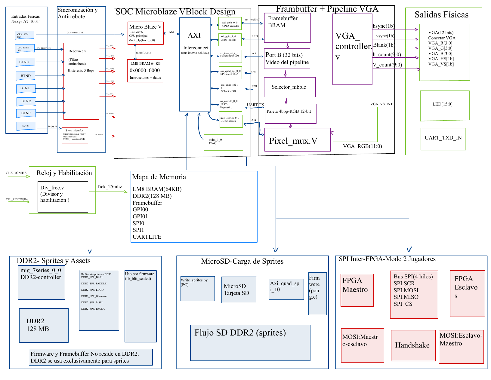

# Pong Multijugador — Nexys A7-100T

Sistema embebido de Pong sobre FPGA con MicroBlaze RISC-V. Soporta modo 1 jugador (con IA) y modo 2 jugadores en pantallas independientes conectadas vía SPI.

**Curso:** EL3313 Taller de Diseño Digital, I Semestre 2026  
**Placa:** Digilent Nexys A7-100T (Artix-7 XC7A100T)  
**Herramientas:** Vivado 2024.1 / Vitis 2024.1

---

## Tabla de contenidos

1. [Requisitos](#1-requisitos)
2. [Estructura del repositorio](#2-estructura-del-repositorio)
3. [Clonar el repositorio](#3-clonar-el-repositorio)
4. [Qué es HoG y por qué lo usamos](#4-qué-es-hog-y-por-qué-lo-usamos)
5. [Paso 1 — Generar el bitstream con Vivado](#5-paso-1--generar-el-bitstream-con-vivado)
6. [Paso 2 — Compilar el firmware con Vitis](#6-paso-2--compilar-el-firmware-con-vitis)
7. [Paso 3 — Preparar la microSD](#7-paso-3--preparar-la-microsd)
8. [Paso 4 — Programar la FPGA](#8-paso-4--programar-la-fpga)
9. [Cómo jugar](#9-cómo-jugar)
10. [Modo 2 jugadores — conexión entre FPGAs](#10-modo-2-jugadores--conexión-entre-fpgas)
11. [Errores comunes y soluciones](#11-errores-comunes-y-soluciones)

---

## 1. Requisitos

### Hardware

- 1 o 2 placas **Nexys A7-100T**
- Cable micro-USB para programación JTAG (viene con la placa)
- Tarjeta **microSD** (cualquier capacidad; clase 4 o superior)
- Lector de tarjetas microSD o adaptador USB para la PC
- Monitor con entrada **VGA** y cable VGA
- Para modo 2 jugadores: 5 cables hembra-hembra para conectar los PMOD JA (SCK, MOSI, MISO, CS, GND)

### Software

| Herramienta | Versión | Uso |
|---|---|---|
| Vivado | 2024.1 | Síntesis, implementación y bitstream |
| Vitis | 2024.1 | Compilar el firmware en C |
| Python 3 | 3.8+ | Escribir sprites en la microSD |
| Pillow (pip) | cualquiera | Procesamiento de imágenes en write_sprites.py |
| Git | cualquiera | Clonar el repositorio y gestionar HoG |

Instalar Pillow si no está disponible:

```bash
pip install Pillow
```

---

## 2. Estructura del repositorio

```
ping_pong_game_project/
├── assets/                  # Imágenes BMP originales (título, menú, gameover)
├── BD/                      # Block Design de Vivado (MicroBlaze V SoC)
│   └── ip/                  # IPs instanciadas (AXI GPIO, AXI SPI, MIG DDR2...)
├── constraints/             # Archivo XDC de pines para la Nexys A7-100T
├── Hog/                     # Herramienta HoG (submódulo Git, no modificar)
├── scripts/
│   ├── build_all.sh         # Build completo del bitstream (Vivado)
│   ├── build_vitis.sh       # Compilar firmware (Vitis)
│   ├── build_bitstream.tcl  # Tcl interno llamado por build_all.sh
│   ├── create_vitis_app.tcl # Tcl interno llamado por build_vitis.sh
│   ├── program_and_run.tcl  # Programar 1 FPGA (modo 1P)
│   ├── program_both.tcl     # Programar 2 FPGAs (modo 2P)
│   └── write_sprites.py     # Escribir sprites en la microSD
├── src/
│   ├── hdl/                 # Archivos Verilog del diseño
│   └── sw/                  # Firmware en C (pong.c) y linker script
├── Top/                     # Configuración HoG del proyecto
│   └── pong_project/
│       ├── hog.conf         # Part, board y opciones de síntesis
│       └── list/            # Listas de fuentes HDL y constraints
└── top_pong_project.xsa     # Hardware handoff para Vitis (generado por Vivado)
```

---

## 3. Clonar el repositorio

HoG es un submódulo de Git. Al clonar hay que inicializarlo también:

```bash
git clone --recurse-submodules https://github.com/JustinAlfaro/ping_pong_game_project.git
cd ping_pong_game_project
```

Si ya clonaste sin `--recurse-submodules` y la carpeta `Hog/` está vacía:

```bash
git submodule update --init --recursive
```

---

## 4. Qué es HoG y por qué lo usamos

**HoG (HDL on Git)** es una herramienta que permite reconstruir un proyecto Vivado completo a partir de los archivos fuente en Git, sin necesitar guardar el proyecto de Vivado en el repositorio.

**Por qué es útil:** Un proyecto Vivado genera cientos de archivos temporales que ocupan varios gigabytes y no tiene sentido versionar. Con HoG solo se guardan los fuentes HDL, el Block Design (`.bd`), las configuraciones de IP (`.xci`) y el archivo de constraints (`.xdc`). Cualquier persona puede regenerar el proyecto completo con un solo comando.

**Cómo funciona en este proyecto:**

- `Top/pong_project/hog.conf` le dice a HoG qué FPGA usar (`xc7a100tcsg324-1`) y las opciones de síntesis.
- `Top/pong_project/list/sources.src` lista todos los archivos HDL y el Block Design.
- `Top/pong_project/list/constraints.con` apunta al XDC de la Nexys A7.
- Al ejecutar `bash scripts/build_all.sh`, el script llama internamente al Tcl de HoG, que lee esos archivos y crea el proyecto Vivado completo en `Projects/pong_project/` de forma automática.

No necesitas abrir Vivado ni configurar nada manualmente. No hay que tocar nada dentro de la carpeta `Hog/`.

---

## 5. Paso 1 — Generar el bitstream con Vivado

El script `build_all.sh` detecta Vivado automáticamente, crea el proyecto desde HoG si no existe, y lanza síntesis + implementación + generación de bitstream.

```bash
bash scripts/build_all.sh
```

El script busca Vivado en este orden:
1. El PATH del sistema (si ya ejecutaste `settings64.sh`)
2. La variable de entorno `VIVADO_ROOT`
3. Rutas comunes: `/tools/Xilinx/Vivado/2024.1`, `/opt/Xilinx/Vivado/2024.1`, etc.

Si Vivado no se detecta automáticamente, carga el entorno antes de correr:

```bash
source /ruta/a/Vivado/2024.1/settings64.sh
bash scripts/build_all.sh
```

O exporta la raíz de instalación:

```bash
export VIVADO_ROOT=/ruta/a/Vivado/2024.1
bash scripts/build_all.sh
```

**Tiempo aproximado:** 15-30 minutos (síntesis e implementación completas).

**Resultado:** `bin/build_latest/top_pong_project.bit` y `top_pong_project.xsa` en la raíz del repo.

---

## 6. Paso 2 — Compilar el firmware con Vitis

El script `build_vitis.sh` detecta Vitis automáticamente, crea la plataforma BSP (Board Support Package) y compila `src/sw/pong.c`.

```bash
bash scripts/build_vitis.sh
```

El workspace de Vitis se crea en `../pong_workspace` (un nivel arriba del repo) por defecto. Para cambiar la ruta:

```bash
WORKSPACE=/ruta/de/tu/eleccion bash scripts/build_vitis.sh
```

Si Vitis no se detecta automáticamente:

```bash
source /ruta/a/Vitis/2024.1/settings64.sh
bash scripts/build_vitis.sh
```

**Resultado:** `../pong_workspace/pong_app/build/pong_app.elf`

> Las rutas de Vivado y Vitis 2024.1 suelen ser idénticas excepto por la palabra `Vivado`/`Vitis`. Ejemplo: si Vivado está en `/tools/Xilinx/Vivado/2024.1`, Vitis estará en `/tools/Xilinx/Vitis/2024.1`.

---

## 7. Paso 3 — Preparar la microSD

Los sprites del juego (título, menú, gameover) se leen desde la microSD. Este paso solo es necesario una vez por tarjeta.

**Insertar la microSD en el lector USB** de la PC (no en la Nexys A7 todavía).

Identificar el dispositivo de la tarjeta:

```bash
lsblk
# Busca una entrada sin número al final, como /dev/sdb o /dev/sdc
# (asegúrate de no confundirla con /dev/sda, que es el disco del sistema)
```

Escribir los sprites:

```bash
sudo python3 scripts/write_sprites.py /dev/sdX
# Reemplaza /dev/sdX con tu dispositivo real
```

> **Advertencia:** usa el dispositivo correcto. El script escribe directamente en sectores de la tarjeta y no formatea ni crea particiones. No uses `/dev/sda`.

---

## 8. Paso 4 — Programar la FPGA

**Insertar la microSD en la ranura de la Nexys A7** (parte inferior de la placa) y encender la placa.

Conectar el cable USB y ejecutar uno de los siguientes comandos:

### Modo 1 jugador

```bash
xsdb scripts/program_and_run.tcl
```

Programa el bitstream y el ELF. El juego arranca automáticamente.

### Modo 2 jugadores

Conectar primero los cables PMOD (ver sección siguiente) y luego:

```bash
xsdb scripts/program_both.tcl
```

Programa ambas FPGAs simultáneamente.

> Si `xsdb` no está en el PATH, carga el entorno de Vitis primero: `source /ruta/a/Vitis/2024.1/settings64.sh`

---

## 9. Cómo jugar

### Controles

| Botón | Función |
|---|---|
| BTNU | Mover paleta hacia arriba |
| BTND | Mover paleta hacia abajo |
| BTNC | Confirmar selección / Pausar durante el juego |
| BTNL / BTNR | Navegar entre opciones del menú |

### Modos de juego

- **1 Jugador:** la paleta derecha es controlada por la IA. Gana quien llegue primero a 7 puntos.
- **2 Jugadores:** cada jugador controla su paleta en su propia pantalla.

### Flujo de pantallas

```
Título → Selección de modo → Juego → (Pausa) → Game Over → Menú
```

Los **LEDs** muestran el marcador en todo momento: bits `[7:4]` = puntos jugador 2, bits `[3:0]` = puntos jugador 1.

---

## 10. Modo 2 jugadores — conexión entre FPGAs

Ambas placas deben estar encendidas y conectadas a monitores independientes.

### Conexión PMOD JA

Conectar con cables hembra-hembra los pines del conector PMOD JA de ambas placas (parte superior izquierda de la placa):

| Pin PMOD JA | Señal | Maestro → Esclavo |
|---|---|---|
| JA1 (pin 1) | SCK | Maestro JA1 → Esclavo JA1 |
| JA2 (pin 2) | MOSI | Maestro JA2 → Esclavo JA2 |
| JA3 (pin 3) | MISO | Maestro JA3 → Esclavo JA3 |
| JA4 (pin 4) | CS_N | Maestro JA4 → Esclavo JA4 |
| GND (pin 5) | GND | Maestro GND → Esclavo GND |

La conexión es directa pin a pin. No hay que cruzar ninguna señal.

### Configuración de switches

- Placa Maestro (campo izquierdo): **SW0 = OFF (abajo)**
- Placa Esclavo (campo derecho): **SW0 = ON (arriba)**

### Secuencia de inicio

1. Conectar los cables PMOD y configurar los switches antes de programar.
2. Ejecutar `xsdb scripts/program_both.tcl`.
3. En ambas pantallas aparece el menú de título.
4. En **ambas** FPGAs navegar hasta seleccionar **2 Jugadores** y presionar BTNC.
5. Las FPGAs hacen un handshake SPI automático y el juego comienza en ambas pantallas.

---

## 11. Errores comunes y soluciones

### No se encontró Vivado / Vitis

El script no pudo detectar la instalación automáticamente. Rutas típicas en laboratorio:

```
/tools/Xilinx/Vivado/2024.1
/tools/Xilinx2/Vivado/2024.1
/opt/Xilinx/Vivado/2024.1
```

Solución:

```bash
source /ruta/a/Vivado/2024.1/settings64.sh   # para build_all.sh
source /ruta/a/Vitis/2024.1/settings64.sh    # para build_vitis.sh y xsdb
```

---

### ELF no encontrado al programar

El firmware aún no ha sido compilado.

```bash
bash scripts/build_vitis.sh
```

---

### XSA no encontrado al correr build_vitis.sh

El bitstream no ha sido generado todavía. Hay que hacer el paso 1 primero.

```bash
bash scripts/build_all.sh   # genera bitstream y XSA
bash scripts/build_vitis.sh  # luego compila el firmware
```

---

### El submódulo Hog/ está vacío

```bash
git submodule update --init --recursive
```

---

### La síntesis falla con errores de pines o DRC

Si el proyecto existía de una sesión anterior con una versión distinta, puede quedar en un estado inconsistente. Borrarlo y regenerar:

```bash
rm -rf Projects/
bash scripts/build_all.sh
```

---

### La pantalla VGA aparece en negro

Posibles causas:

1. **microSD no preparada:** ejecutar `write_sprites.py` y reinsertar antes de programar.
2. **Bitstream desactualizado:** borrar `Projects/` y regenerar con `build_all.sh`.
3. **Calibración DDR2 lenta:** el script espera 4 segundos. Si la placa tarda más, editar `program_and_run.tcl` y cambiar `after 4000` por `after 7000`.

---

### Modo 2P: las FPGAs no sincronizan

1. Verificar los 5 cables PMOD (SCK, MOSI, MISO, CS, GND).
2. Verificar que SW0=OFF en el Maestro y SW0=ON en el Esclavo.
3. Asegurarse de seleccionar "2 Jugadores" en **ambas** pantallas antes de que expire el timeout.
4. Reprogramar ambas FPGAs: `xsdb scripts/program_both.tcl`.

---

### Permission denied al escribir la microSD

```bash
sudo python3 scripts/write_sprites.py /dev/sdX
```

---

### ModuleNotFoundError: No module named 'PIL'

```bash
pip install Pillow
# o en algunos sistemas:
pip3 install Pillow
```

---

## Nota de uso de Inteligencia Artificial

En el desarrollo de este proyecto se utilizó Claude (Anthropic) como herramienta de asistencia. El uso incluyó las siguientes áreas:

- **Firmware (pong.c):** asistencia en la implementación del modo 2 jugadores vía SPI, depuración de la colisión de la paleta derecha, sincronización del marcador entre FPGAs y corrección de errores de timing en el protocolo SPI.
- **Scripts de build y programación:** generación de `build_all.sh`, `build_vitis.sh`, `program_both.tcl` y `program_and_run.tcl`.
- **Documentación:** estructura y contenido del README.
- **Depuración general:** identificación de causas raíz en problemas de DDR2, SPI en modo esclavo y sincronización entre FPGAs.

El diseño RTL (`src/hdl/`), el Block Design en Vivado, las constraints XDC y la arquitectura general del sistema fueron desarrollados por el equipo.

**Ejemplos de interacción:**

> **Prompt:** "Los LEDs del maestro están todos apagados, pero cuando toca la pelota sí se ve un patrón momentáneamente."
>
> **Respuesta (resumen):** Se identificó que el esclavo tenía `pad[1].y = 210` correcto (LEDs = `01101001`), pero el maestro recibía `remote_y = 0` porque el `SPICR_TXRST` en el reload del loop borraba los bytes del FIFO inmediatamente después de escribirlos, antes de que el AXI completara la propagación. Se eliminó el TXRST del loop y se confió en el ciclo natural 8-in/8-out del FIFO.

---

> **Prompt:** "Sigue sin rebotar..."
>
> **Respuesta (resumen):** Diagnóstico progresivo vía LEDs: se determinó que el AXI Quad SPI en modo esclavo solo transmite fiablemente el byte 0 del TX FIFO. La solución fue codificar `pad[1].y >> 1` (rango 0–210, cabe en `uint8`) en el byte 0, y reconstruir en el maestro con `rx[0] << 1`.


# Diagrama de bloques del proyecto Pong

El siguiente diagrama resume la arquitectura general del proyecto: entradas físicas de la Nexys A7-100T, sincronización y antirrebote, SoC MicroBlaze V, bus AXI, framebuffer, pipeline VGA, salidas físicas, DDR2, MicroSD y comunicación SPI inter-FPGA.


