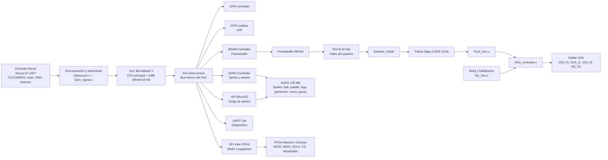

# Diagrama de bloques del proyecto Pong

El siguiente diagrama resume la arquitectura general del proyecto: entradas físicas de la Nexys A7-100T, sincronización y antirrebote, SoC MicroBlaze V, bus AXI, framebuffer, pipeline VGA, salidas físicas, DDR2, MicroSD y comunicación SPI inter-FPGA.

## Versión simplificada en Mermaid

